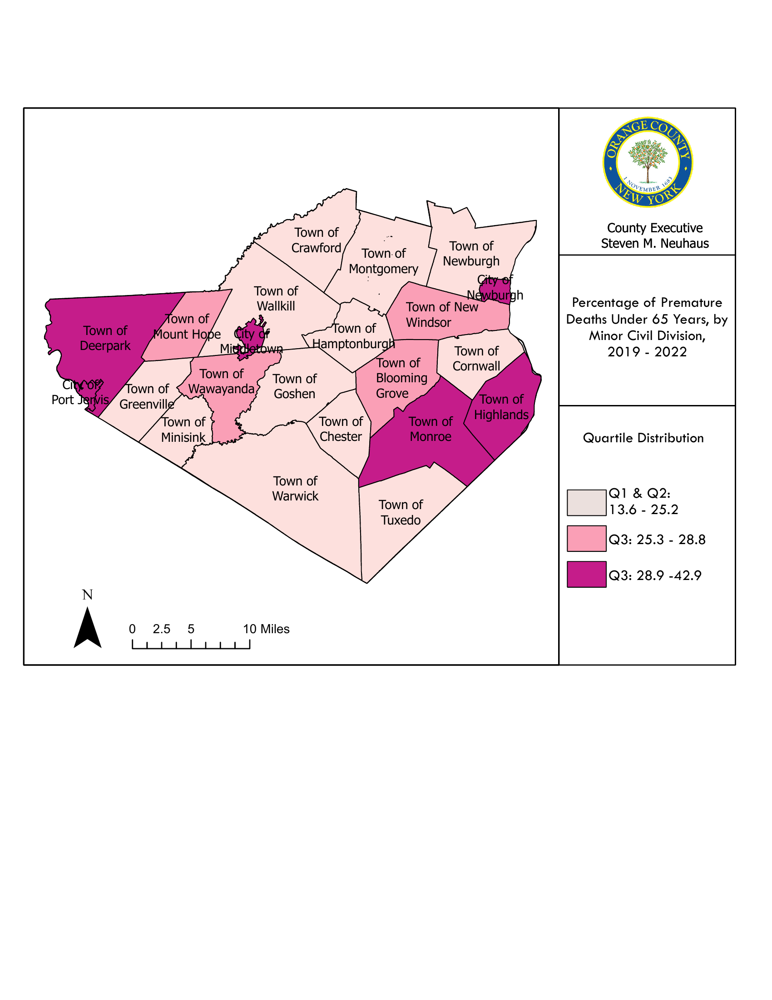

```{python}
#| echo: false
#| warning: false
#| message: false
import sys
from pathlib import Path

# Ensure root-level modules (scripts/) are importable in both Quarto run contexts.
cwd = Path.cwd()
project_root = cwd if (cwd / "scripts").exists() else cwd.parent
if str(project_root) not in sys.path:
    sys.path.insert(0, str(project_root))

# Point this at your workbook in data/raw/ once you add it.
CHA_WORKBOOK_PATH = project_root / "data" / "raw" / "workbook.xlsx"
```

<!-- WORKED EXAMPLE - the standard pattern for adding a data object to a section.
     Generate the object file with scripts/generate_chapter_objects.py (it writes to
     chapters/_generated/objects/<id>.qmd), then reference it and document its source:



::: {.callout-note collapse="true"}
## Source
Data source citation, accessed Month Year.
:::

::: {.callout-note}
Note: Methodology notes for this indicator.
:::
-->

Mortality measures the frequency and distribution of deaths in a population and serves as a summary indicator of community health and health system performance. In this section, mortality is presented across three complementary lenses: all-cause mortality (overall burden and distribution of deaths), leading causes of death (the primary conditions and injuries driving mortality), and premature death (deaths occurring earlier than expected, reflecting preventable and inequitable loss of life).

## All-Cause Mortality

Across 2020–2023, Orange County recorded 12,712 deaths, with the age-adjusted all-cause mortality rate declining from 887.8 per 100,000 in 2020 to 708.2 in 2023. This is consistent with the elevated mortality conditions observed during the first year of the COVID-19 pandemic followed by improvement in subsequent years [@tbl-all-cause-mortal-rate-age-zip-code-rande].

Mortality also differed by sex, with males consistently experiencing higher age-adjusted all-cause mortality than females from 2020–2023 [@fig-all-cause-mortal-aar-sex].

Geographic differences were evident across the four cities of Orange County [@fig-all-cause-mortal-rate-zip]. Over 2020–2023, rates ranged from 936.3 per 100,000 in ZIP 10940 (lowest) to 1,752.7 in ZIP 12550 (highest), with 10950 (1,322.3) and 12771 (1,086.6) falling between these extremes. There was a pattern of improvement from 2020–2023: 12550 remained highest each year but declined from 2,103.9 (2020) to 1,487.2 (2023); 10940 decreased from 1,035.8 to 809.8; 10950 was reduced from 1,688.6 to 1,203.3; and 12771 stayed comparatively stable, remaining near ~1,100 across the period.

Differences by race and ethnicity were also observed in all-cause mortality. Age-adjusted comparisons indicate a persistent inequity burden, with Non-Hispanic Black residents experiencing the highest age-adjusted mortality rate in Orange County (2020–2022) [@fig-all-cause-mortal-aar-rande].

<!-- Table 9: All-Cause Mortality, Rate per 100,000 Population by Age, ZIP Code, Race and Ethnicity, 2020–2023  -->


<!-- Figure 3: All-Cause Mortality, Rate per 100,000 Population by Race and Ethnicity, 2020–2022 -->


<!-- Figure 4: All-Cause Mortality, Rate per 100,000 Population by ZIP Code, 2020–2023 -->


<!-- Figure 5: All-Cause Mortality, Rate per 100,000 Population by Sex, 2020–2023 -->


## Leading Causes of Death

In 2022, heart disease and cancer were the two leading causes of death in Orange County by both count and age-adjusted rate, followed by unintentional injury, COVID-19, and chronic lower respiratory disease (CLRD). This profile reflects the combined influence of chronic disease, injury, and infectious disease [@tbl-top-five-leading-death-count-aar].

Cause patterns differ when examined by sex from 2020–2022 [@tbl-number-deaths-leading-sex]. Over that period, unintentional injury and suicide contributed disproportionately to male mortality, while Alzheimer’s disease and cerebrovascular disease (stroke) appeared more prominently among females, alongside the continued dominance of heart disease and cancer for both sexes.

<!-- Table 10: Top Five Leading Causes of Death, by Count and Age-Adjusted Rate per 100,000 Population, 2022 -->


<!-- Table 11: Number of Deaths from Leading Causes by Sex, 2020–2022 -->


## Premature Death

Premature death highlights deaths occurring earlier in the life course and is used as an indicator of preventable mortality and health inequities. In Orange County, premature death measures consistently indicated disproportionate burden among historically underserved populations, including elevated premature mortality among Non-Hispanic Black and Hispanic residents [@fig-premature-deaths-rande]. In addition, premature death is not proportionate
across communities, with some municipalities experiencing substantially higher percentages than others, with the City of Newburgh being the highest at 42.9%. 

<!-- Figure 6: Percentage of Premature Deaths Under 65 Years, by Minor Civil Division, 2019–2022 -->
{#fig-premature-death-mcd fig-cap="Percentage of Premature Deaths Under 65 Years, by Minor Civil Division, 2019–2022" fig-alt="Percentage of Premature Deaths Under 65 Years, by Minor Civil Division, 2019–2022" width="100%"}

::: {.callout-note collapse="true"}
## Source
NYS Prevention Agenda Tracking Dashboard, October 2025, sourced from Vital Statistics of NYS
https://apps.health.ny.gov/public/tabvis/PHIG_Public/pa/
:::

<!-- Figure 7: Percentage of Deaths that are Premature, by Race and Ethnicity, 2018–2020 -->
