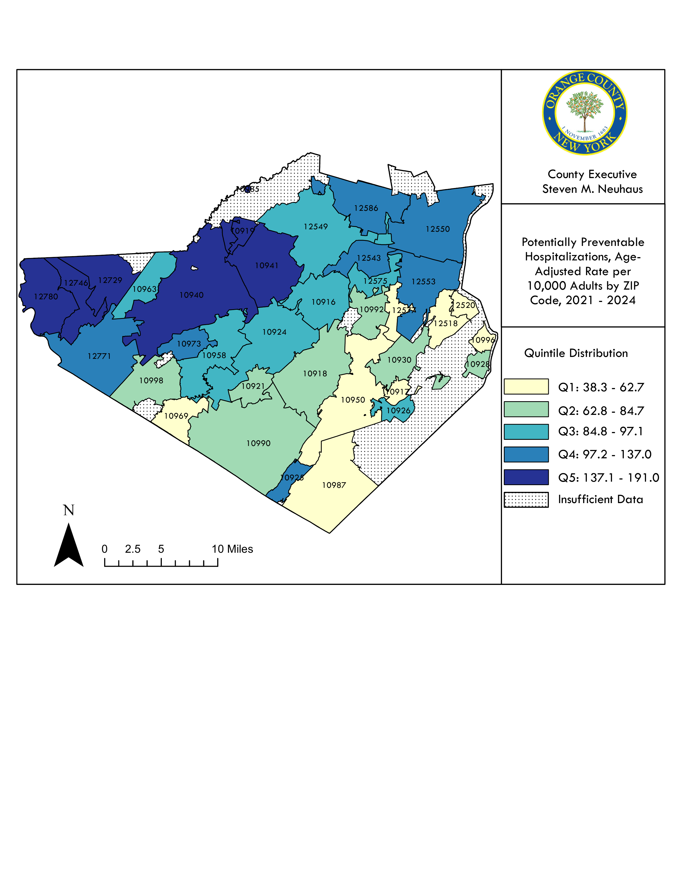
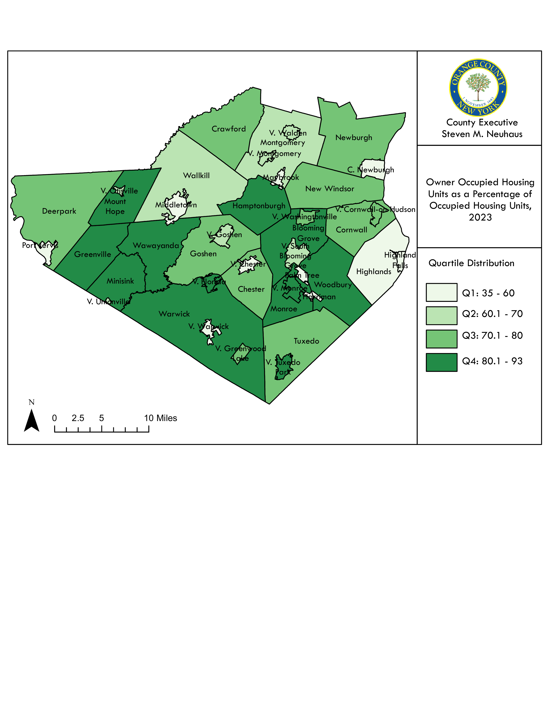
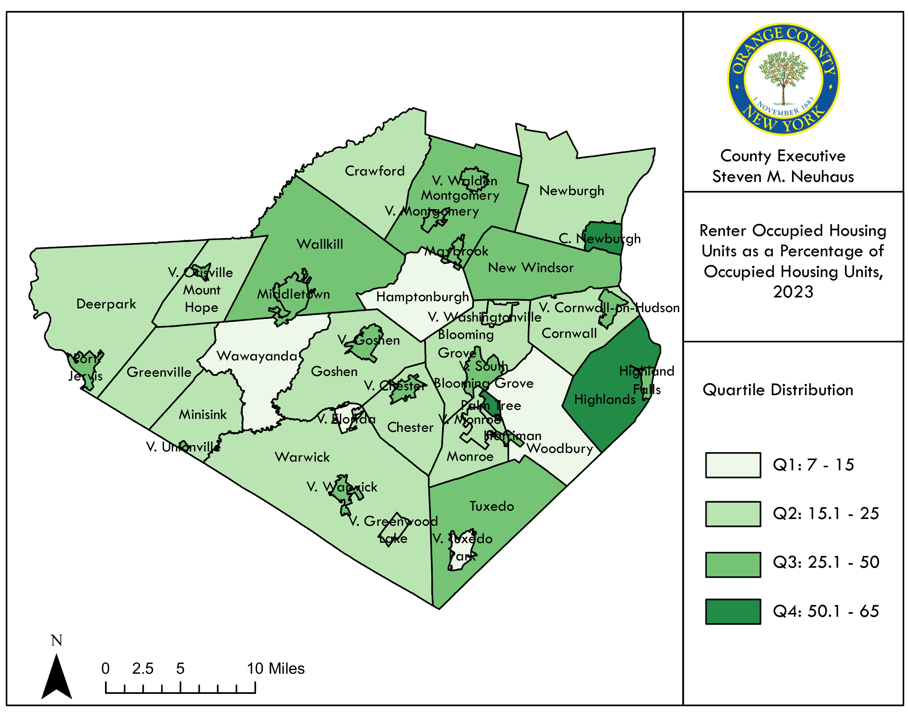
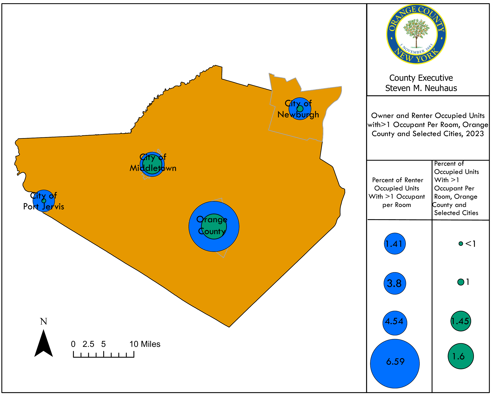

```{python}
#| echo: false
#| warning: false
#| message: false
import sys
from pathlib import Path

# Ensure root-level modules (scripts/) are importable in both Quarto run contexts.
cwd = Path.cwd()
project_root = cwd if (cwd / "scripts").exists() else cwd.parent
if str(project_root) not in sys.path:
    sys.path.insert(0, str(project_root))

# Point this at your workbook in data/raw/ once you add it.
CHA_WORKBOOK_PATH = project_root / "data" / "raw" / "workbook.xlsx"
```

<!-- WORKED EXAMPLE - the standard pattern for adding a data object to a section.
     Generate the object file with scripts/generate_chapter_objects.py (it writes to
     chapters/_generated/objects/<id>.qmd), then reference it and document its source:



::: {.callout-note collapse="true"}
## Source
Data source citation, accessed Month Year.
:::

::: {.callout-note}
Note: Methodology notes for this indicator.
:::
-->

Social determinants of health (SDOH) describe the conditions in the environments where people are born, live, learn, work, play, worship, and age, as well as the systems that shape access to opportunity and resources. In Orange County, SDOH indicators vary substantially across municipalities and school districts. This section summarizes key measures across five domains—Economic Stability, Education Access and Quality, Health Care Access and Quality, Neighborhood and Built Environment, and Social and Community Context—using the tables and figures listed below.

While key indicators are summarized here, more data emphasizing the difference in health outcomes rooted in broader social and economic inequities is found in the Health Equity Dashboard[^1] that can be accessed via the OCDOH website.

[^1]: Orange County Department of Health, Health Equity Dashboard, [https://www.orangecountygov.com/2361/Dashboard-Portal](https://www.orangecountygov.com/2361/Dashboard-Portal), accessed August 2025.

Orange County’s 2023 median household income was $96,497 [@tbl-income-poverty-gini]. However, the municipal range is wide, with the highest reported median income in Tuxedo Park Village ($250,000+) and substantially lower median incomes in municipalities such as Palm Tree Town ($43,171) and the City of Newburgh ($51,006) [@tbl-income-poverty-gini]. Countywide, 15.8% of households were below the federal poverty level, while 25.9% were below the local poverty level [@tbl-income-poverty-gini], reflecting that the local poverty threshold is higher than the federal threshold across household sizes [@tbl-poverty-threshold]. In 2023, 28.8% of county households reported incomes above $150,000 [@tbl-income-poverty-gini]. Across time, Orange County’s population living below the federal poverty level was 14.4% in 2022, compared with 15.7% in New York State and 14.0% in the Mid-Hudson Region [@fig-poverty-pop]. Poverty burden is also reflected in absolute counts: 51,238 Orange County residents were estimated to be living in poverty, including 19,619 children under age 18 [@tbl-poverty-age-rande]. Among children, Orange County’s poverty rate was 21.0% in 2022, compared with 18.6% statewide and 15.8% regionally [@fig-children-poverty-threshold].

Differences by race and ethnicity are evident in the census-based poverty figures. In 2023, the share living below the federal poverty level was 9.3% among non-Hispanic White residents, compared with 17.7% among non-Hispanic Black residents and 21.2% among Hispanic/Latino residents [@fig-poverty-individual-rande]. Among families with related children under age 18, 5.3% of non-Hispanic White families were below poverty, compared with 16.0% of non-Hispanic Black families and 11.1% of Hispanic/Latino families [@fig-poverty-family-rande]. Employment conditions also shifted over time, including a clear pandemic-era increase: Orange County’s unemployment rate rose from 3.8% (2019) to 10.2% (2020) and then declined to 3.4% (2023) [@fig-percentage-of-labor-force-unemp].

<!-- Table 12: Household Median Income, 2023 -->


<!-- Table 13: Poverty Threshold by Size of Family and Number of Related Children Under 18 Years, 2024-->


<!-- Table 14: Population Living in Poverty by Age Group, Race and Ethnicity, 2023  -->


<!-- Figure 8: Population in Poverty, 2019–2022-->



<!-- Figure 9: Individual Poverty Status in the Past 12 Months, by Race and Ethnicity, 2023 -->



<!-- Figure 10: Poverty Status of Families in the Past 12 Months, by Race and Ethnicity, 2023 -->



<!-- Figure 11: Children Living Below the Poverty Threshold, 2019–2022 -->



<!-- Table 15: Employment Status by Municipality, 2023  -->


<!-- Figure 12: Percentage of Labor Force Unemployed, 2020–2023 -->



## Education Access and Quality

Orange County’s four-year high school graduation rate was 88% in 2023, exceeding the New York State comparison value (86%) [@fig-hs-graduation-rande]. Graduation outcomes varied across school districts, with high rates in districts such as Cornwall (97%), Warwick (95%), and Washingtonville (95%), and lower rates in districts such as Newburgh (71%) and Port Jervis City (80%) [@tbl-graudation-rate-demographic].

Among adults age 25 and older, Orange County’s 2023 educational attainment profile included 10.3% with less than a high school education, 28.0% with a high school diploma (or equivalent), 19.1% with some college and no degree, and 42.6% with a postsecondary credential (associate’s degree or higher), including 18.2% with a bachelor’s degree and 14.1% with a graduate or professional degree [@tbl-educational-attain].

Language indicators show additional variation relevant to educational access. Countywide, 29.2% of residents age 5+ spoke a language other than English at home, including 14.7% speaking Spanish and 12.0% speaking other Indo-European languages [@tbl-language-spoken-home].

<!-- Table 16: Demographic Profile and Graduation Rates by Public School District, 2023–2024 -->


<!-- Table 17: Educational Attainment of Persons 25 years and Over, 2023 -->


<!-- Figure 13: High School Graduation Rate, 2021-2023 -->



<!-- Table 18: Language Spoken at Home by Municipality, 2023 -->


<!-- Table 19: English Language Learners, Economically Disadvantaged, and Students with Disabilities by Public School District, 2023–2024 -->


## Health Care Access and Quality

Potentially preventable hospitalizations are commonly interpreted as a proxy indicator of primary care access and chronic disease management. From 2021–2024, Orange County’s rate was 104.4 per 10,000, compared with 84.9 in NYS excluding NYC and 91.4 statewide [@fig-preventable-hosp-25]. Within the county, rates varied notably across ZIP codes, ranging from 59.8 (ZIP 10950) to 190.7 (ZIP 10919) [@fig-preventable-hosp-25].

Insurance coverage also varied by race and ethnicity. Overall, 4.8% of Orange County residents were uninsured in 2023. Uninsured prevalence was higher among Hispanic/Latino residents (9.5%) compared with non-Hispanic White residents (2.6%). The rate was 4.2% among non-Hispanic Black residents [@fig-uninsured-rande].

<!-- Figure 14: Potentially Preventable Hospitalizations, Age-Adjusted Rate per 10,000 Adults by ZIP Code, 2021–2024 -->
{#fig-preventable-hosp-25 fig-cap="Potentially Preventable Hospitalizations, Age-Adjusted Rate per 10,000 Adults by ZIP Code, 2021–2024" fig-alt="Potentially Preventable Hospitalizations, Age-Adjusted Rate per 10,000 Adults by ZIP Code, 2021–2024" width="100%"}

::: {.callout-note collapse="true"}
## Source
NYS Prevention Agenda Tracking Dashboard, October 2025 sourced from NY Statewide Planning and Research Cooperative System https://apps.health.ny.gov/public/tabvis/PHIG_Public/pa/#
:::

::: {.callout-note}
Note: This includes adults aged 18 years and older. This indicator is defined as the combination of the 10 Prevention Quality Indicators that pertain to adults: (1) Short-term Complication of Diabetes; (2) Long-term Complication of Diabetes; (3) Chronic Obstructive Pulmonary Disease (COPD) or Asthma in Older Adults; (4) Hypertension; (5) Heart Failure; (6) Community-Acquired Pneumonia; (7) Urinary Tract Infection; (8) Uncontrolled Diabetes; (9) Asthma in Younger Adults; and (10) Lower-Extremity Amputation Among Patients with Diabetes. Because this estimates the number of potentially avoidable hospital admissions, a lower rate is desirable. The rates were age-adjusted to the US 2000 standard population.
:::

<!-- Figure 15: Uninsured Civilian Noninstitutionalized Population, by Race and Ethnicity, 2023 -->




## Neighborhood and Built Environment 

Transportation access differs across the county. In 2023, 11,823 households (8.6%) had no vehicle (Table 20).
The share without a vehicle was substantially higher in the Town of Palm Tree (35.1%), and the cities of
Newburgh (23.6%), and Port Jervis (19.4%) (Table 20). Commuting patterns also varied: the county’s mean
travel time to work was 34.2 minutes, and 11.5% of workers worked from home (Table 21). Mean travel time
ranged from 45.7 minutes in the Village of Woodbury to 19.0 minutes in the Town of Highlands (Table 21).
Housing conditions show differences in tenure, costs, and crowding. Of 137,311 occupied housing units, 93,959
(68.4%) were owner-occupied and 43,352 (31.6%) were renter-occupied (Table 22). Orange County had
11,149 vacant housing units in 2023 (Table 22). For homeowners, the county’s median home value was
$361,100 and median selected monthly owner costs (with a mortgage) were $2,653. Of these owner occupied
homes, 30,065 were cost stressed (Table 24). For renters, the median gross rent was $1,580, and 24,456 renter
households were cost-stressed (Table 25).
Environmental and connectivity indicators provide additional context. Orange County’s incidence of confirmed
high blood lead levels among tested children <72 months declined from 10.5 per 1,000 (2014) to 3.7 per
1,000 (2021), while remaining above the Mid-Hudson Region in 2021 (2.8) (Figure 19). Digital access also
varied: 9.7% of households lacked internet access and 9.2% relied on cellular data only, with markedly higher
“no internet” prevalence in Palm Tree Town (74.7%) (Table 27). 

<!-- Table 20: Percentage of Households with No Available Vehicles, 2023 -->


<!-- Table 21: Commuting to Work by Municipality, 2023 -->


<!-- Table 22: Housing Tenure and Vacancy Status by Municipality, 2023 -->


<!-- Table 23: Housing Unit Ages by Municipality, 2023 -->


<!-- Table 24: Selected Housing Characteristics for Homeowners by Municipality, 2023 -->



<!-- Figure 16: Owner Occupied Housing Units as a Percentage of Occupied Housing Units, 2023 -->
{#fig-owner-occupied-housing-units fig-cap="Owner Occupied Housing Units as a Percentage of Occupied Housing Units, 2023" fig-alt="Owner Occupied Housing Units as a Percentage of Occupied Housing Units, 2023" width="100%"}

::: {.callout-note collapse="true"}
## Source
Source: US Census Bureau, American Community Survey 2019–2023 5-Year Population Estimates, Table B25003-Tenure, December 2025
https://data.census.gov/table/ACSDT5Y2023.B25003?q=owner+occupied&g=050XX00US36071$0600000_060XX00US3607107003,3607115308,3607118300,3607118916,3607119961,3607129553,3607130631,3607131907,3607134550,3607147042,3607147713,3607147999,3607148153,3607148857,3607150034,3607150045,3607150848,3607156185,3607159388,3607175781,3607177992,3607178366,3607178839,3607182755_160XX00US3615297,3618333,3626319,3629542,3632325,3634495,3639853,3646162,3647988,3648142,3655673,3668610,3675779,3675803,3676210,3677849,3678355,3678465,3682750&y=2023&tp=true
:::

::: {.callout-note}
Note: Town totals include Village totals. The Village of Harriman is split between the Towns of Monroe and Woodbury. 
:::

<!-- Table 25: Selected Housing Characteristics for Renters by Municipality, 2023 -->


<!-- Figure 17: Renter Occupied Housing Units as a Percentage of Occupied Housing Units, 2023 -->
{#fig-renter-occupied-housing-units fig-cap="Renter Occupied Housing Units as a Percentage of Occupied Housing Units, 2023" fig-alt="Renter Occupied Housing Units as a Percentage of Occupied Housing Units, 2023" width="100%"}

::: {.callout-note collapse="true"}
## Source
Source: US Census Bureau, American Community Survey 2019–2023 5-Year Population Estimates, Table B25003-Tenure, December 2025
https://data.census.gov/table/ACSDT5Y2023.B25003?q=owner+occupied&g=050XX00US36071$0600000_060XX00US3607107003,3607115308,3607118300,3607118916,3607119961,3607129553,3607130631,3607131907,3607134550,3607147042,3607147713,3607147999,3607148153,3607148857,3607150034,3607150045,3607150848,3607156185,3607159388,3607175781,3607177992,3607178366,3607178839,3607182755_160XX00US3615297,3618333,3626319,3629542,3632325,3634495,3639853,3646162,3647988,3648142,3655673,3668610,3675779,3675803,3676210,3677849,3678355,3678465,3682750&y=2023&tp=true
:::

::: {.callout-note}
Note: Town totals include Village totals. The Village of Harriman is split between the Towns of Monroe and Woodbury. 
:::

<!-- Table 26: Owner versus Renter Occupancy Per Room by Municipality, 2023 -->


<!-- Figure 18: Owner and Renter Occupied Units with >1 Occupant per Room, Orange County and Selected Cities, 2023 -->
{#fig-owner-renter-occupancy-per-room fig-cap="Owner and Renter Occupied Units with >1 Occupant per Room, Orange County and Selected Cities, 2023" fig-alt="Owner and Renter Occupied Units with >1 Occupant per Room, Orange County and Selected Cities, 2023" width="100%"}

::: {.callout-note collapse="true"}
## Source
Source: US Census Bureau, American Community Survey 2019–2023 5-Year Population Estimates, Table B25003-Tenure, December 2025
https://data.census.gov/table/ACSDT5Y2023.B25003?q=owner+occupied&g=050XX00US36071$0600000_060XX00US3607107003,3607115308,3607118300,3607118916,3607119961,3607129553,3607130631,3607131907,3607134550,3607147042,3607147713,3607147999,3607148153,3607148857,3607150034,3607150045,3607150848,3607156185,3607159388,3607175781,3607177992,3607178366,3607178839,3607182755_160XX00US3615297,3618333,3626319,3629542,3632325,3634495,3639853,3646162,3647988,3648142,3655673,3668610,3675779,3675803,3676210,3677849,3678355,3678465,3682750&y=2023&tp=true
:::

::: {.callout-note}
Note: Town totals include Village totals. The Village of Harriman is split between the Towns of Monroe and Woodbury
:::

<!-- Figure 19: Incidence of Confirmed High Blood Lead Level, Rate per 1,000 Tested Children Aged < 72 Months, 2018–2021 -->




<!-- Table 27: Type of Internet Access per Household by Municipality, 2023 -->


## Social and Community Context 

Orange County Department of Social Services measures show several shifts from 2022–2024 [@tbl-pop-served-ocdss]. Child Protective Services reports were 3,611 (2022), 3,831 (2023), and 3,620 (2024), while the monthly average number of children in care declined from 248 (2022) to 201 (2024). The number of families receiving preventive services decreased from 127 (2023) to 116 (2024), and children discharged to adoption totaled 28 (2022), 23 (2023), and 25 (2024) [@tbl-pop-served-ocdss].

Indicators related to economic assistance and housing instability increased over the same period. Temporary Assistance applications rose from 3,434 (2022) to 4,181 (2024), and SNAP cases increased from 17,002 to 18,923 [@tbl-pop-served-ocdss]. The monthly average number of individuals experiencing homelessness increased from 265 (2022) to 737 (2024), and average hotel/motel placements increased from 19 (2022) to 230 (2024) [@tbl-pop-served-ocdss].

<!-- Table 28: Population Served by Orange County Department of Social Services, 2022–2024 -->

