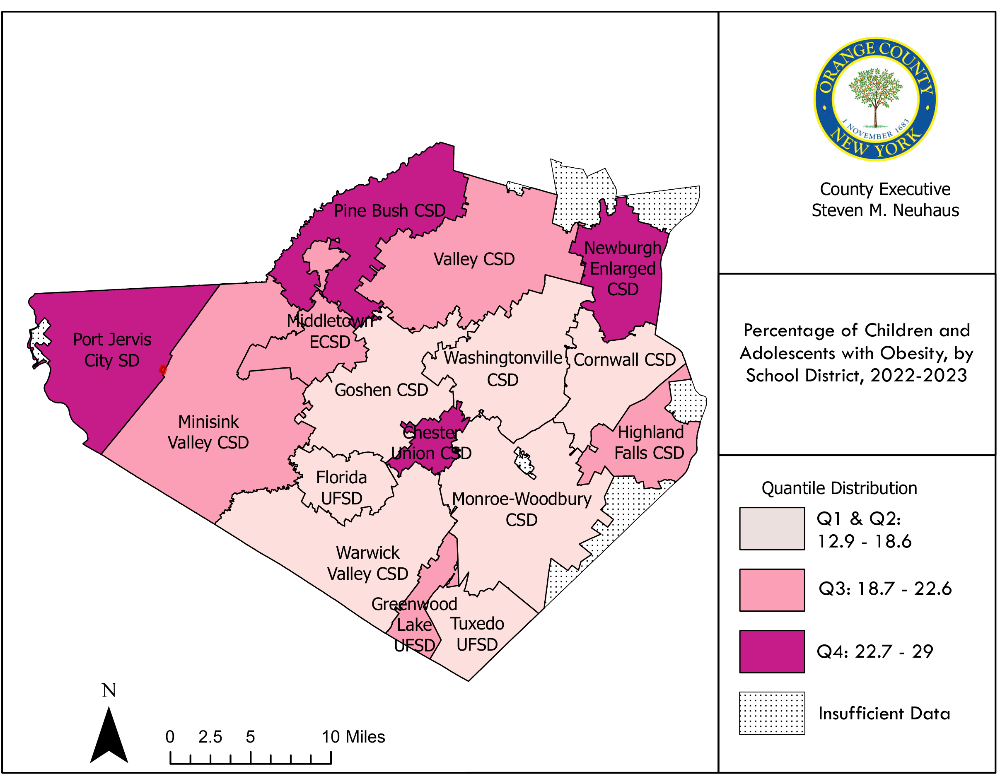

```{python}
#| echo: false
#| warning: false
#| message: false
import sys
from pathlib import Path

# Ensure root-level modules (scripts/) are importable in both Quarto run contexts.
cwd = Path.cwd()
project_root = cwd if (cwd / "scripts").exists() else cwd.parent
if str(project_root) not in sys.path:
    sys.path.insert(0, str(project_root))

# Point this at your workbook in data/raw/ once you add it.
CHA_WORKBOOK_PATH = project_root / "data" / "raw" / "workbook.xlsx"
```

<!-- WORKED EXAMPLE - the standard pattern for adding a data object to a section.
     Generate the object file with scripts/generate_chapter_objects.py (it writes to
     chapters/_generated/objects/<id>.qmd), then reference it and document its source:



::: {.callout-note collapse="true"}
## Source
Data source citation, accessed Month Year.
:::

::: {.callout-note}
Note: Methodology notes for this indicator.
:::
-->

The Leading Health Issues section synthesizes information regarding major contributors to morbidity and mortality
in Orange County. Indicators are organized into four subsections—Chronic Disease, Cancer, Communicable
Disease, and Maternal Child Health—to align measures that are typically reported through different surveillance
and reporting streams. The Chronic Disease subsection focuses on non-cancer, non-communicable conditions
captured across mortality, healthcare utilization, and prevalence indicators. 

## Chronic Disease
### Diseases of the Circulatory System
Across 2020–2023, the age-adjusted diseases of the circulatory system mortality rate in Orange County
remained within a relatively narrow band, ranging from 186.4 to 198.4 per 100,000, with a most recent value
of 193.6 per 100,000 in 2023 [@fig-dzcircsystem-mortal-aar]. Sex-stratified trends show a persistent disparity across the full
period: males experienced higher age-adjusted mortality than females each year, with 2023 rates of 238.7 per
100,000 for males compared with 157.7 per 100,000 for females [@fig-dzcircsystem-mortal-sex-aar].
Disparities were also evident by race and ethnicity. Over 2020–2023, diseases of the circulatory system
mortality rate for Non-Hispanic White exceeded the rates reported for Non-Hispanic Black, Hispanic, and Other
populations; in 2023, the rate was 275.9 per 100,000 among Non-Hispanic White residents compared with
200.1 per 100,000 among Non-Hispanic Black residents and 79.1 per 100,000 among Hispanic residents
[@tbl-dzcircsystem-count-rate-age-rande-zip]. Geographic variation was also present across zip code geographies in the workbook; in 2023, zip
code 12550 had the highest listed circulatory disease mortality rate (413.9 per 100,000) compared with 235.4
per 100,000 in zip code 10940 [@fig-dzcircsystem-mortal-zip]. 

<!-- Table 29: Diseases of the Circulatory System Mortality, Case Counts and Rates per 100,000 Population by Age, Race and Ethnicity, and ZIP Code, 2020–2023 -->


<!-- Figure 20: Diseases of the Circulatory System Mortality, Age-Adjusted Rate per 100,000, 2020–2023 -->



<!-- Figure 21: Diseases of the Circulatory System Mortality, Rate per 100,000 Population by Race and Ethnicity, 2020–2023 -->



<!-- Figure 22: Diseases of the Circulatory System Mortality, Rate per 100,000 Population by ZIP Code, 2020–2023 -->



<!-- Figure 23: Diseases of the Circulatory System Mortality, Age-Adjusted Rate per 100,000 by Sex, 2020–2023 -->



### Diseases of the Heart
Diseases of the heart mortality in Orange County ranged from 157.5 to 179.8 per 100,000 during 2020–2023, with a most recent value of 167.4 per 100,000 in 2023 (676 deaths) [@tbl-heartdz-mortal-rande-zip]. The age-adjusted heart disease mortality rate ranged from 144.8 to 161.2 per 100,000 over the same period and was 155.8 per 100,000 in 2023 [@fig-heartdz-mortal-aar]. A consistent sex disparity was present across 2020–2023: in 2023, the age-adjusted heart disease mortality rate was 202.9 per 100,000 among males and 119.2 per 100,000 among females [@fig-heartdz-mortal-sex-aar]. By race and ethnicity, the heart disease mortality rate in 2023 was highest among Non-Hispanic White residents (196.9 per 100,000) compared with 113.9 per 100,000 among Non-Hispanic Black residents and 81.2 per 100,000 among Hispanic residents [@tbl-heartdz-mortal-rande-zip]. Zip code variation was also observed; in 2023, zip code 12550 had the highest listed heart disease mortality rate (315.0 per 100,000) compared with 199.6 per 100,000 in zip code 10940 [@fig-heartdz-mortal-zip]. As with other mortality indicators, rates increased substantially with age; in 2023, the heart disease mortality rate among residents age 85+ was 3,651.8 per 100,000 [@tbl-heartdz-mortal-rande-zip].

<!-- Table 30: Heart Disease Mortality, Case Counts and Rates per 100,000 Population by Age, Race and Ethnicity, and ZIP Code, 2020–2023 -->


<!-- Figure 24: Diseases of the Heart Mortality, Age-Adjusted Rate per 100,000,2020–2023 -->



<!-- Figure 25: Diseases of the Heart Mortality, Age-Adjusted Rate per 100,000 Population by Race and Ethnicity, 2020–2022 -->



<!-- Figure 26: Diseases of the Heart Mortality, Rate per 100,000 Population by ZIP Code, 2020–2023 -->



<!-- Figure 27: Diseases of the Heart Mortality, Age-Adjusted Rate per 100,000 by Sex, 2020–2023 -->



### Cerebrovascular Disease

Cerebrovascular disease mortality ranged from 22.8 to 30.4 per 100,000 during 2020–2023, with a most recent value of 22.8 per 100,000 in 2023 (92 deaths) [@tbl-cerebrovascdz-mortal-rande-zip]. The age-adjusted cerebrovascular mortality rate ranged from 19.9 to 25.3 per 100,000 and was 19.9 per 100,000 in 2023 [@fig-cerebrovascdz-mortal-aar]. Sex patterns varied by year; in 2023, the age-adjusted rate was 22.6 per 100,000 for females and 19.3 per 100,000 for males [@fig-cerebrovascdz-mortal-sex-aar].

Hospitalization disparities by race and ethnicity were evident for cerebrovascular diseases from 2020–2022. During 2020–2022, the Orange County total cerebrovascular hospitalization rate was 21.9 per 10,000, and the rate was higher among Non-Hispanic Black residents (29.4 per 10,000) than among Non-Hispanic White residents (17.6 per 10,000) [@fig-cerebrovascdz-hosp-rande-aar].

<!-- Figure 28: Cerebrovascular Disease Hospitalizations, Age-Adjusted
Rate per 10,000 Population by Race and Ethnicity, 2020–2022 -->



<!-- Table 31: Cerebrovascular Disease Mortality, Case Counts and Rates per 100,000 Population by Age, Sex, Race and Ethnicity, and ZIP Code, 2020–2023 -->


<!-- Figure 29: Cerebrovascular Disease Mortality, Age-Adjusted Rate per 100,000, 2020–2023 -->



<!-- Figure 30: Cerebrovascular Disease Mortality, Age-Adjusted Rate per 100,000 by Sex, 2020–2023 -->
Age-Adjusted Rate per 100,000 by Sex, 2020–2023 -->



### Other Diseases of the Circulatory System

Other diseases of the circulatory system mortality ranged from 16.2 to 18.6 per 100,000 during 2020–2023, with a most recent value of 18.1 per 100,000 in 2023 (73 deaths) [@tbl-other-dzcircsystem-count-rate-age-rande-zip]. As with other mortality measures in this subsection, suppression (“s”) was used in some stratified rows where small counts limited stable rate estimation [@tbl-other-dzcircsystem-count-rate-age-rande-zip].

<!-- Table 32: Other Diseases of the Circulatory System Mortality, Case Counts and Rates per 100,000 Population by Age, Race and Ethnicity, and ZIP Code, 2020–2023 -->


<!-- Figure 31: Other Diseases of the Circulatory System Mortality,
Age-Adjusted Rate per 100,000, 2020–2023 -->



<!-- Figure 32: Other Diseases of the Circulatory System Mortality, Rate per 100,000 by Race and Ethnicity, 2020–2023 -->



<!-- Figure 33: Circulatory System Disease Mortality,
Rate per 100,000 by ZIP Code, 2020–2023 -->



<!-- Figure 34: Circulatory System Disease Mortality, Age-Adjusted Rate per 100,000 by Sex, 2020–2023 -->



### Chronic Lower Respiratory Disease

Chronic lower respiratory disease (CLRD) mortality declined across 2020–2023, ranging from 20.3 to 35.6 per 100,000, with 20.3 per 100,000 in 2023 (82 deaths) [@tbl-clrd-mortal-rande-zip]. The age-adjusted CLRD mortality rate ranged
from 20.4 to 32.8 per 100,000 and was 20.4 per 100,000 in 2023 [@fig-clrd-mortal-aar]. In 2023, the age-adjusted CLRD mortality rate was higher among males (21.8 per 100,000) than females (19.7 per 100,000) [@fig-clrd-mortal-sex-aar].

The Orange County CLRD hospitalization (2020–2022) rate was 11.9 per 10,000, with a higher rate among Non-Hispanic Black residents (22.5 per 10,000) than among Non-Hispanic White residents (11.7 per 10,000) [@fig-clrd-hosp-rande-aar].

<!-- Figure 35: Chronic Lower Respiratory Disease Hospitalization, Age-Adjusted
Rate per 10,000 Population by Race and Ethnicity, 2020–2022 -->



<!-- Table 33: Chronic Lower Respiratory Disease Mortality, Case Counts and Rates per 100,000 Population by Age, Race and Ethnicity, and ZIP Code, 2020–2023  -->


<!-- Figure 36: Chronic Lower Respiratory Disease Mortality, Age-Adjusted Rate per 100,000, 2020–2023 -->



<!-- Figure 37: Chronic Lower Respiratory Disease Mortality, Rate per 100,000 by Sex, 2020–2023 -->



### Asthma
The asthma quality indicator (QI) rate in Orange County ranged from 55.6 to 59.1 per 10,000 during 2021–
2024, with 58.1 per 10,000 in 2024 [@fig-asthma-pp-admissions-crude-rate-2-17-years]. In 2024, Orange County’s value (58.1 per 10,000) was higher
than Mid-Hudson (52.9 per 10,000) and higher than New York State excluding NYC (56.8 per 10,000), while
New York State was 60.6 per 10,000 [@fig-asthma-pp-admissions-crude-rate-2-17-years].
Asthma hospitalizations (2020–2022) showed substantial race and ethnicity disparities. For 2020–2022, the
total Orange County asthma hospitalization rate was 7.2 per 10,000, and the rate among Non-Hispanic Black
residents (24.0 per 10,000) was notably higher than among Non-Hispanic White residents (4.7 per 10,000)
[@fig-asthma-hosp-rande-aar]. A similar pattern was observed for child asthma hospitalizations (2020–2022), where the Orange
County total was 6.9 per 10,000, and the Non-Hispanic Black rate (21.5 per 10,000) exceeded the NonHispanic White rate (5.1 per 10,000) [@fig-asthma-hosp-0-17-rande-aar]. 

<!-- Figure 38: Asthma Hospitalization, Age-Adjusted Rate per 10,000 Population by Race and Ethnicity, 2020–2022 -->



<!-- Figure 39: Asthma Hospitalization, Age-Adjusted Rate per 10,000, Aged 0–17 Years Population by Race and Ethnicity, 2020–2022 -->



<!-- Figure 40: Potentially Preventable Asthma Admissions, Crude Rate per 10,000 Children Aged 2–17 Years, 2021–2024 -->



## Pneumonia and Influenza
Pneumonia mortality ranged from 15.3 to 19.9 per 100,000 during 2020–2023, with 17.4 per 100,000 in
2023 (70 deaths) [@tbl-pneumoniaflu-count-rate-age-rande-zip]. The age-adjusted pneumonia mortality rate ranged from 14.4 to 18.9 per
100,000 and was 17.4 per 100,000 in 2023 [@fig-pneumoniaflu-mortal-aar]. In 2023, males had higher age-adjusted pneumonia
mortality (21.6 per 100,000) than females (14.5 per 100,000) [@fig-pneumoniaflu-mortal-sex-aar].
Potentially preventable community acquired pneumonia admissions in Orange County ranged from 81.4 to
104.3 per 10,000 during 2021–2024, with 84.7 per 10,000 in 2024 [@fig-pppneumonia-adult-aar]. In 2024, Orange County
(84.7 per 10,000) was lower than the Mid-Hudson region (92.2 per 10,000) and substantially lower than New
York State excluding NYC (111.6 per 10,000) [@fig-pppneumonia-adult-aar].
While key indicators are summarized here, during the respiratory disease season, more data offering insights
into respiratory health trends in Orange County are found in the Respiratory Illness Dashboard[^2] that can be
accessed via the <a href="https://www.orangecountygov.com/2361/Dashboard-Portal">OCDOH website</a>. 

<!-- Figure 41: Potentially Preventable Community Acquired Pneumonia Admissions, Crude Rate per 10,000, 2021–2024 -->



<!-- Table 34: Potentially Preventable Community Acquired Pneumonia Admissions, Crude Rate per 10,000, 2021–2024 -->


<!-- Figure 42: Pneumonia Mortality, Age-Adjusted Rate per 100,000, 2020–2023 -->



<!-- Figure 43: Pneumonia Mortality, Rate per 100,000 by Sex, 2020–2023 -->




## Diabetes

Diabetes mortality ranged from 12.6 to 17.0 per 100,000 during 2020–2023, with 13.6 per 100,000 in 2023
(55 deaths) [@tbl-dm-count-rate-age-rande-zip]. The age-adjusted diabetes mortality rate ranged from 12.4 to 16.4 per 100,000 during
2020–2023 and was 15.5 per 100,000 in 2023 [@fig-dm-mortal-aar]. Sex patterns varied over time; in 2023, the ageadjusted diabetes mortality rate was 17.2 per 100,000 among females and 13.9 per 100,000 among males
[@fig-dm-mortal-sex-aar]. 

Diabetes hospitalization indicators (2020–2022) demonstrate disparities by race and ethnicity. For 2020–2022,
the Orange County hospitalization rate for diabetes (any diagnosis) was 183.2 per 10,000, and the rate among
Non-Hispanic Black residents (298.3 per 10,000) exceeded the rate among Non-Hispanic White residents
(157.2 per 10,000) [@fig-dm-anydx-hosp-rande-aar]. For diabetes hospitalizations where diabetes was the primary diagnosis (2020–
2022), the Orange County total was 71.0 per 10,000, and again the Non-Hispanic Black rate (115.0 per
10,000) was higher than the Non-Hispanic White rate (62.6 per 10,000) [@fig-dm-primarydx-hosp-rande-aar]. 

<!-- Figure 44: Diabetes Hospitalization, Age-Adjusted Rate per 10,000 Population by Race and Ethnicity, 2020–2022 -->



<!-- Figure 45: Diabetes Hospitalization, Age-Adjusted Rate per 10,000 Population by Race and Ethnicity, 2020–2022 -->



<!-- Table 35: Diabetes Mortality, Case Counts and Rates per 100,000 Population by Age, Sex, Race and Ethnicity, and ZIP Code, 2020–2023 --> 


<!-- Figure 46: Diabetes Mortality, Age-Adjusted Rate per 100,000, 2020–2023 -->



<!-- Figure 47: Diabetes Mortality, Rate per 100,000 by Sex, 2020–2023 -->



## Obesity

Adult overweight or obesity prevalence in Orange County ranged from 64.7% to 75.1% across the time points
presented (2013–2014, 2016, 2018, 2021), with a most recent value of 75.1% in 2021 [@fig-overweight-obese-adult]. In 2021,
Orange County’s value (75.1%) was higher than Mid-Hudson region (72.6%) and higher than New York State
excluding NYC (66.7%) and New York State (67.7%) [@fig-overweight-obese-adult]. Adult obesity prevalence ranged from 29.2%
to 38.7% across the same time points, with a most recent value of 38.7% in 2021 [@fig-obese-adult]. In 2021, Orange
County’s obesity prevalence (38.7%) exceeded Mid-Hudson (35.9%), New York State excluding NYC (30.6%),
and New York State (32.3%) [@fig-obese-adult].

For childhood obesity prevalence (2022–2023), Orange County’s value was 21.0% with comparison values of
20.2% for New York State excluding NYC and 19.2% for New York State [@fig-childhood-obesity]. The district-level values
in the same figure ranged from 15.5% (Minisink Valley SD) to 23.1% (Newburgh City SD), indicating withincounty variation across school district geographies [@fig-childhood-obesity]. 

<!-- Figure 48: Adult Overweight or Obesity Prevalence, 2013–2014, 2016, 2018, 2021 -->



<!-- Figure 49: Adult Obesity Prevalence, 2013–2014, 2016, 2018, 2021 -->



<!-- Figure 50: Childhood Obesity Prevalence, 2022–2023 -->
{#fig-childhood-obesity fig-cap="Percentage of Children and Adolescents with Obesity, by School District, 2022–2023" fig-alt="Percentage of Children and Adolescents with Obesity, by School District, 2022–2023" width="100%"}

::: {.callout-note collapse="true"}
## Source
Source: NYS Student Weight Status Category Reporting System, April 2025
https://nyshc.health.ny.gov/web/nyapd/student-weight-data-explorer
:::
::: {.callout-note}
Note: Student BMI is reported from health examination forms provided to the school from the previous school year. Forms submitted for
students in grades Pre-K, K, 1, 3, 5, 7, 9, 11 are used as the documentation for students currently in grades 1, 2, 4,6, 8, 10 and 12. Data from school districts within a county are aggregated to produce estimates of the percentage of students who were reported to be in each weight status category. Percentages were calculated by dividing the number of reported students in a weight status category by the total number of students with weight status category information.
:::

## Cirrhosis

Cirrhosis mortality ranged from 9.6 to 12.0 per 100,000 during 2020–2023, with 9.7 per 100,000 in 2023 (39
deaths) [@tbl-liverdz-count-rate-age-rande-zip]. The age-adjusted cirrhosis mortality rate ranged from 9.6 to 12.2 per 100,000 and was 9.6
per 100,000 in 2023 [@fig-liverdz-mortal-aar]. In each year 2020–2023, males had higher age-adjusted cirrhosis mortality
than females; in 2023, the rate was 13.4 per 100,000 for males and 6.4 per 100,000 for females [@fig-liverdz-mortal-sex-aar]. 

<!-- Table 36: Cirrhosis Mortality, Case Counts and Rates per 100,000 Population by Age, Sex, Race and Ethnicity, and ZIP Code, 2020–2023 -->


<!-- Figure 51: Cirrhosis Mortality, Age-Adjusted Rate per 100,000, 2020–2023 -->



<!-- Figure 52: Cirrhosis Mortality, Rate per 100,000 by Sex, 2020–2023 -->



## Chronic Kidney Disease

For chronic kidney disease (CKD) emergency department (ED) visits, Orange County ranged from 131.2 to 139.1
per 10,000 during 2018–2021, with a most recent value of 139.1 per 10,000 in 2021 [@fig-ckd-edvisit-aar]. In 2021,
Orange County’s CKD ED visit rate (139.1 per 10,000) was lower than New York State excluding NYC (170.0
per 10,000) and New York State (180.6 per 10,000) [@fig-ckd-edvisit-aar].

CKD hospitalizations ranged from 18.0 to 18.9 per 10,000 during 2018–2021, with 18.9 per 10,000 in 2021
[@fig-ckd-hosp-rate]. In 2021, Orange County’s CKD hospitalization rate (18.9 per 10,000) was below Mid-Hudson (19.6
per 10,000), New York State excluding NYC (22.2 per 10,000), and New York State (22.7 per 10,000) [@fig-ckd-hosp-rate]. 

<!-- Figure 53: Chronic Kidney Disease Emergency Department Visits, Rate per 10,000, 2018–2021 -->



<!-- Figure 54: Chronic Kidney Disease Hospitalizations, Rate per 10,000, 2018–2021 -->



[^2]: Orange County Department of Health, Respiratory Illness Dashboard, [https://www.orangecountygov.com/2361/Dashboard-Portal](https://www.orangecountygov.com/2361/Dashboard-Portal), accessed August 2025. 


## Cancer

Cancer burden in Orange County is summarized in this subsection using all sites combined cancer incidence
[@fig-allsitesca-incidence-aar] and [@fig-allsitesca-incidence-rande-aar] and malignant neoplasm (cancer) mortality, including annual counts and rates and selected stratifications [@tbl-allsitescombined-count-rate-age-rande-zip] [@fig-neoplasm-mortal-aar]-[@fig-neoplasm-mortal-sex-aar]. Incidence is presented as an age-adjusted rate for the multi-year period 2018–2022, while mortality is presented across 2020–2023, including both crude (population) rates and
age-adjusted rates, with additional detail by sex, race/ethnicity, and selected zip codes [@fig-allsitesca-incidence-aar]-[@fig-neoplasm-mortal-sex-aar]; [@tbl-allsitescombined-count-rate-age-rande-zip]. The workbook also includes age-adjusted all-cancer mortality indicators from CHIRS (2017–2020) and the cancer registry (2018–2022), including race/ethnicity stratification [@fig-cancerall-mortal-aar-three]-[@fig-cancerall-incidence-rande-aar-five], and site-specific incidence and mortality indicators for lung and bronchus, colon and rectum, breast, cervix uteri, and prostate cancer
[@fig-lungbronchus-incidence-aar-single]-[@fig-prostate-mortal-rande-aar-five].

### Cancer Incidence (All Sites Combined)

For 2018–2022, Orange County’s all sites combined cancer incidence rate was 470.3 per 100,000 population
(age-adjusted), compared with 499.1 in NYS excluding NYC and 466.8 in NYS overall [@fig-allsitesca-incidence-aar]. Incidence
patterns by race/ethnicity in the same 2018–2022 period show disparities within Orange County: Non-Hispanic
White residents had an incidence rate of 497.8 per 100,000, compared with 436.8 among Non-Hispanic Black
residents, 298.7 among Non-Hispanic Asian/Pacific Islander residents, and 356.0 among Hispanic (Any Race)
residents [@fig-allsitesca-incidence-rande-aar]. 

<!-- Figure 55: Cancer Incidence, All Sites Combined, Age-Adjusted Rate per 100,000, 2018–2022 -->



<!-- Figure 56: Cancer Incidence, All Sites Combined, Rate per 100,000 by Race and Ethnicity, 2018–2022 -->



<!-- Table 37: Cancer Incidence, All Sites Combined, Case Counts and Rates per 100,000 Population by Age, Race and Ethnicity, and ZIP Code, 2018–2022 -->


### Malignant Neoplasms

Across 2020–2023, Orange County recorded 2,382 malignant neoplasm deaths in total, with an average crude
mortality rate of 150.3 per 100,000 population [@tbl-neoplasm-count-rate-age-rande-zip]. Annually, the crude mortality rate declined from
157.3 per 100,000 in 2020 (601 deaths) to 139.8 in 2022 (561 deaths), then increased to 154.5 in 2023 (624
deaths) [@tbl-neoplasm-count-rate-age-rande-zip]. The age-adjusted malignant neoplasm mortality rate showed a similar pattern over 2020–
2023, decreasing from 141.7 per 100,000 in 2020 to 126.1 in 2022, then increasing to 140.1 in 2023 [@fig-neoplasm-mortal-aar].

Sex-stratified age-adjusted mortality rates indicate a higher burden among males compared with females
across the 2020–2023 timespan; in 2023, the age-adjusted malignant neoplasm mortality rate was 159.6 per
100,000 among males versus 126.1 among females [@fig-neoplasm-mortal-sex-aar]. Mortality rates by race/ethnicity also
demonstrate disparities: in 2023, the malignant neoplasm mortality rate was 213.6 per 100,000 among NonHispanic White residents compared with 127.1 among Non-Hispanic Black residents, 41.7 among Hispanic
residents, and 70.0 among residents categorized as Other [@fig-neoplasm-mortal-rande]. Geographic variation is shown for
selected zip codes; in 2023, crude malignant neoplasm mortality rates exceeded the county overall rate of
154.5 per 100,000 in zip codes 12550 (289.4), 12771 (257.9), and 10950 (216.8), while 10940 was 150.7
[@fig-neoplasm-mortal-zip]. 

<!-- Table 37: Malignant Neoplasm Mortality, Case Counts and Rates per 100,000 Population by Age, Race and Ethnicity, and ZIP Code, 2020–2023 -->


<!-- Figure 57: Malignant Neoplasm Mortality, Age-Adjusted Rate per 100,000, 2020–2023 -->



<!-- Figure 58: Malignant Neoplasm Mortality, Rate per 100,000 by Race and Ethnicity, 2020–2023 -->



<!-- Figure 59: Malignant Neoplasm Mortality, Rate per 100,000 by ZIP Code, 2020–2023 -->



<!-- Figure 60: Malignant Neoplasm Mortality, Rate per 100,000 by Sex, 2020–2023 -->




### All-Cancer Mortality

Across 2017–2020, Orange County’s age-adjusted all-cancer mortality rate declined from 196.0 per 100,000
(2017) to 156.4 (2020), with 2020 also below the Mid-Hudson rate (176.0) and above NYS excluding NYC
(152.9) and NYS overall (149.2) [@fig-cancerall-mortal-aar-three]. For the registry-based 2018–2022 period, Orange County’s ageadjusted all-cancer mortality rate was 167.1 per 100,000, compared with 138.6 in NYS excluding NYC and
101.2 in NYS overall [@fig-cancerall-mortal-aar-five]. Mortality stratified by race/ethnicity for 2018–2022 shows variation within
Orange County, with rates of 165.7 per 100,000 among Non-Hispanic White residents and 189.2 among NonHispanic Black residents [@fig-cancerall-incidence-rande-aar-five]. 

<!-- Figure 61: All-Cancer Mortality, Age-Adjusted Rate per 100,000, 2017–2020 -->



<!-- Figure 62: All-Cancer Mortality, Age-Adjusted Rate per 100,000, 2018–2022 -->



<!-- Figure 63: All-Cancer Mortality, Rate per 100,000 by Race and Ethnicity, 2018–2022 -->



### Lung and Bronchus Cancer

Orange County’s age-adjusted lung and bronchus cancer incidence rate declined from 62.7 per 100,000 (2017)
to 59.8 (2020), with the 2020 county rate below Mid-Hudson (67.5), NYS excluding NYC (73.9), and NYS
overall (75.4) [@fig-lungbronchus-incidence-aar-single]. For the registry-based 2018–2022 period, Orange County’s age-adjusted lung and
bronchus cancer incidence rate was 59.9 per 100,000, compared with 66.3 in NYS excluding NYC and 63.4 in
NYS overall [@fig-lungbronchus-incidence-aar-five]. Within Orange County, incidence rates varied by race/ethnicity during 2018–2022,
including 66.0 per 100,000 among Non-Hispanic White residents and 48.8 among Non-Hispanic Black residents
[@fig-lungbronchus-incidence-rande-aar-five].

Mortality trends based on CHIRS show Orange County’s age-adjusted lung and bronchus cancer mortality rate
decreasing from 48.8 per 100,000 (2017) to 38.4 (2020), with the 2020 county rate below Mid-Hudson (48.6),
NYS excluding NYC (50.4), and NYS overall (50.0) [@fig-lungbronchus-mortal-aar-single]. For the registry-based 2018–2022 period,
Orange County’s age-adjusted lung and bronchus cancer mortality rate was 37.9 per 100,000, compared with
39.2 in NYS excluding NYC and 35.9 in NYS overall [@fig-lungbronchus-mortal-aar-five]. Mortality rates by race/ethnicity in Orange
County (2018–2022) indicate higher burden among Non-Hispanic Black residents (38.9 per 100,000) than NonHispanic White residents (33.8) [@fig-lungbronchus-mortal-rande-aar-five]. 

<!-- Figure 64: Lung and Bronchus Cancer Incidence, Age-Adjusted Rate per 100,000, 2017–2022 -->



<!-- Figure 65: Lung and Bronchus Cancer Incidence, Age-Adjusted Rate per 100,000, 2018–2022 -->



<!-- Figure 66: Lung and Bronchus Cancer Incidence, Age-Adjusted Rate per 100,000 Population by Race and Ethnicity, 2018–2022 -->



<!-- Figure 67: Lung and Bronchus Cancer Mortality, Age-Adjusted Rate per 100,000, 2017–2020 -->



<!-- Figure 68: Lung and Bronchus Cancer Mortality, Age-Adjusted Rate per 100,000, 2018–2022 -->



<!-- Figure 69: Lung and Bronchus Cancer Mortality, Age-Adjusted Rate per 100,000 Population by Race and Ethnicity, 2018–2022 -->



### Colon and Rectum Cancer

For 2018–2022, Orange County’s age-adjusted colon and rectum cancer incidence rate was 36.0 per 100,000,
similar to NYS excluding NYC (36.8) and NYS overall (35.8) [@fig-colonrectum-incidence-aar-five]. Incidence rates by race/ethnicity in
Orange County during 2018–2022 show differences across groups, including 37.8 per 100,000 among NonHispanic White residents and 30.3 among Non-Hispanic Black residents [@fig-colonrectum-incidence-rande-aar-five].

For 2018–2022, the age-adjusted colon and rectal cancer mortality rate in Orange County is shown as 14.8 per
100,000 (Total), compared with 11.4 in NYS excluding NYC and 10.9 in NYS overall [@fig-colonrectum-mortal-aar-five]. Within
Orange County, registry mortality rates varied by race/ethnicity, including 20.8 per 100,000 among NonHispanic Black residents and 14.3 among Non-Hispanic White residents [@fig-colonrectum-mortal-rande-aar-five]. 

<!-- Figure 70: Colon and Rectum Cancer Incidence, Age-Adjusted Rate per 100,000, 2018–2022 -->



<!-- Figure 71: Colon and Rectum Cancer Incidence, Age-Adjusted Rate per 100,000 Population by Race and Ethnicity, 2018–2022 -->



<!-- Figure 72: Colon and Rectum Cancer Mortality, Age-Adjusted Rate per 100,000, 2018–2022 -->



<!-- Figure 73: Colon and Rectum Cancer Mortality, Age-Adjusted Rate per 100,000 Population by Race and Ethnicity, 2018–2022 -->



### Breast Cancer

CHIRS trends show Orange County’s age-adjusted breast cancer incidence rate increasing from 137.4 per
100,000 (2017) to 159.4 (2020), exceeding the Mid-Hudson rate (132.8) in 2020 and similar to NYS excluding
NYC (159.5) and NYS overall (154.2) [@fig-femalebreast-incidence-aar-single]. For the registry-based 2018–2022 period, Orange County’s
age-adjusted breast cancer incidence rate was 154.0 per 100,000, compared with 158.7 in NYS excluding
NYC and 150.3 in NYS overall [@fig-femalebreast-incidence-aar-five]. Incidence by race/ethnicity in Orange County (2018–2022) shows
higher incidence among Non-Hispanic White residents (162.0 per 100,000) compared with Non-Hispanic Black
residents (149.9) and Hispanic residents (116.2) [@fig-femalebreast-incidence-rande-aar-five].

CHIRS trends show Orange County’s age-adjusted breast cancer mortality rate decreasing from 26.8 per
100,000 (2017) to 22.0 (2020), remaining above Mid-Hudson (18.2), NYS excluding NYC (18.0), and NYS
overall (17.4) in 2020 [@fig-femalebreast-mortal-aar-single]. For the registry-based 2018–2022 period, Orange County’s age-adjusted
breast cancer mortality rate was 23.5 per 100,000, compared with 17.7 in NYS excluding NYC and 17.0 in
NYS overall [@fig-femalebreast-mortal-aar-five]. Within Orange County, mortality by race/ethnicity indicates higher mortality among
Non-Hispanic Black residents (34.6 per 100,000) compared with Non-Hispanic White residents (23.3) and
Hispanic residents (13.7) [@fig-femalebreast-mortal-rande-aar-five]. 

<!-- Figure 74: Breast Cancer Incidence, Age-Adjusted Rate per 100,000, 2017–2020 -->



<!-- Figure 75: Breast Cancer Incidence, Age-Adjusted Rate per 100,000, 2018–2022 -->



<!-- Figure 76: Breast Cancer Incidence, Age-Adjusted Rate per 100,000 Population by Race and Ethnicity, 2018–2022 -->



<!-- Figure 77: Breast Cancer Mortality, Age-Adjusted Rate per 100,000, 2017–2020 -->



<!-- Figure 78: Breast Cancer Mortality, Age-Adjusted Rate per 100,000, 2018–2022 -->



<!-- Figure 79: Breast Cancer Mortality, Age-Adjusted Rate per 100,000 Population by Race and Ethnicity, 2018–2022 -->



### Cervix Uteri Cancer 

CHIRS trends show Orange County’s age-adjusted cervix uteri cancer incidence rate increasing from 7.5 per
100,000 (2017) to 8.2 (2020), remaining above Mid-Hudson (7.6), NYS excluding NYC (7.4), and NYS overall
(7.5) in 2020 [@fig-cervixuteri-incidence-aar-single]. For 2018–2022, Orange County’s registry-based age-adjusted cervix uteri cancer
incidence rate was 7.1 per 100,000, compared with 6.9 in NYS excluding NYC and 7.1 in NYS overall [@fig-cervixuteri-incidence-aar-five].

CHIRS trends show Orange County’s age-adjusted cervix uteri cancer mortality rate increasing from 1.6 per
100,000 (2017) to 2.3 (2020), exceeding Mid-Hudson (1.9), NYS excluding NYC (1.9), and NYS overall (2.0) in
2020 [@fig-cervixuteri-mortal-aar-single]. For 2018–2022, Orange County’s registry-based age-adjusted cervix uteri cancer mortality
rate was 3.3 per 100,000, compared with 2.2 in NYS excluding NYC and 2.5 in NYS overall [@fig-cervixuteri-mortal-aar-five]. 

<!-- Figure 80: Cervix Uteri Cancer Incidence, Age-Adjusted Rate per 100,000, 2017–2020 -->



<!-- Figure 81: Cervix Uteri Cancer Incidence, Age-Adjusted Rate per 100,000, 2018–2022 -->



<!-- Figure 82: Cervix Uteri Cancer Mortality, Age-Adjusted Rate per 100,000, 2017–2020 -->



<!-- Figure 83: Cervix Uteri Cancer Mortality, Age-Adjusted Rate per 100,000, 2018–2022 -->



### Prostate Cancer

CHIRS trends show Orange County’s age-adjusted prostate cancer incidence rate increasing from 92.4 per
100,000 (2017) to 129.0 (2020), with the 2020 county rate above Mid-Hudson (112.8), NYS excluding NYC
(118.6), and NYS overall (112.5) [@fig-prostate-incidence-aar-single]. For 2018–2022, Orange County’s registry-based age-adjusted
prostate cancer incidence rate was 112.5 per 100,000, compared with 112.7 in NYS excluding NYC and 110.2
in NYS overall [@fig-prostate-incidence-aar-five]. Incidence by race/ethnicity in Orange County shows higher incidence among NonHispanic Black residents (148.0 per 100,000) compared with Non-Hispanic White residents (109.4) and Hispanic
residents (87.8) [@fig-prostate-incidence-rande-aar-five].

CHIRS trends show Orange County’s age-adjusted prostate cancer mortality rate increasing from 18.3 per
100,000 (2017) to 22.8 (2020), exceeding Mid-Hudson (20.4), NYS excluding NYC (18.4), and NYS overall
(17.7) in 2020 [@fig-prostate-mortal-aar-single]. For 2018–2022, Orange County’s registry-based age-adjusted prostate cancer
mortality rate was 20.4 per 100,000, compared with 18.7 in NYS excluding NYC and 18.1 in NYS overall
[@fig-prostate-mortal-aar-five]. Mortality by race/ethnicity indicates a substantially higher prostate cancer mortality rate among
Non-Hispanic Black residents (43.1 per 100,000) compared with Non-Hispanic White residents (18.5) and
Hispanic residents (20.0) [@fig-prostate-mortal-rande-aar-five]. 

<!-- Figure 84: Prostate Cancer Incidence, Age-Adjusted Rate per 100,000, 2017–2020 -->



<!-- Figure 85: Prostate Cancer Incidence, Age-Adjusted Rate per 100,000, 2018–2022 -->



<!-- Figure 86: Prostate Cancer Incidence, Age-Adjusted Rate per 100,000 Population by Race and Ethnicity, 2018–2022 -->



<!-- Figure 87: Prostate Cancer Mortality, Age-Adjusted Rate per 100,000, 2016–2021 Age-Adjusted Rate per 100,000 Population, 2016–2021 -->



<!-- Figure 88: Prostate Cancer Mortality, Age-Adjusted Rate per 100,000, 2018–2022 -->



<!-- Figure 89: Prostate Cancer Mortality, Age-Adjusted Rate per 100,000 Population by Race and Ethnicity, 2018–2022 -->



## Communicable Disease

Communicable diseases are illnesses caused by infectious agents (e.g., viruses, bacteria, parasites) that spread
through person-to-person contact, respiratory droplets or aerosols, sex, contaminated food or water, or other
exposures. These diseases continue to pose a significant health burden in Orange County; [@tbl-cd-count-rate] displays the
most common infectious diseases reported in the county from 2021–2023.

During this period, the COVID-19 pandemic peaked between 2021 and 2022; however, reported cases
declined in 2023 amid widespread at-home testing and shifting healthcare-seeking patterns. Following the
NYSDOH mandate to report respiratory syncytial virus (RSV) on December 20, 2023, Orange County logged
422 confirmed RSV cases before year’s end.

In 2022, NYSDOH adopted the new Council for State and Territorial Epidemiologists (CSTE) and CDC case
definition for Lyme Disease. The subsequent rise in cases reflects a shift toward using laboratory evidence alone
rather than requiring supplemental clinical data. Consequently, Lyme disease case numbers from 2022 and
onward should not be compared directly to previous years.

Pertussis cases resurged in 2023 with 110 cases—roughly triple the 2022 total. This highlights the ongoing
importance of routine childhood and adolescent vaccination, adult boosters for close contacts of infants, and
timely post-exposure prophylaxis in households, schools, and other congregate settings. Similarly, enteric
diseases rose sharply in 2023 (412 total cases) driven primarily by shigellosis, followed by campylobacteriosis
and salmonellosis. The epidemiology of these infections, often linked to person-to-person spread, food handling,
and environmental contamination, reaffirms the value of prevention measures such as meticulous hand hygiene,
safe food preparation, rapid case interviews, and timely exclusion guidance for high-risk settings.
Finally, increases in anaplasmosis (76) and babesiosis (82) emphasize the need for sustained seasonal prevention
messaging, clinician education for prompt diagnosis and treatment, and tick-bite precautions for outdoor
recreation exposures. In 2023, the county also recorded 1,970 total cases of STIs: 1,488 cases of chlamydia,
354 cases of gonorrhea, and 128 syphilis cases. For more information on sexually transmitted infections, see
[@fig-chlamydia-aar; @fig-chlamydia-rande; @fig-gonorrhea-aar; @fig-gonorrhea-rande; @fig-hiv-aids-incidence-aar; @fig-hiv-prevalence-transmission-category; @fig-hiv-linkage-care-rande; @fig-prep-coverage; @fig-syphilis-early-aar; @fig-syphilis-rande; @tbl-chlamydia-count-rate-sex-rande-age-zip; @tbl-gonorrhea-count-rate-sex-rande-age-zip; @tbl-hiv-prevalence-rate-rande-age-sex], and the STI Annual Report which can be accessed via the <a href="https://www.orangecountygov.com/149/Health">OCDOH website</a>.


### General Communicable Disease
COVID-19 represented the largest reportable communicable disease burden in Orange County during 2021–
2023 and declined substantially in the most recent year shown, from 67,448 cases (16,810.0 per 100,000) in 2022 to 20,504 cases (5,077.3 per 100,000) in 2023; the 2021–2023 total was 148,447 cases (12,358.8 per
100,000) [@tbl-cd-count-rate]. Influenza activity also shifted notably across years. Influenza A decreased from 11,866
cases (2,957.4 per 100,000) in 2022 to 4,127 cases (1,021.9 per 100,000) in 2023, while influenza B
increased from 165 cases (41.1 per 100,000) in 2022 to 1,660 cases (411.1 per 100,000) in 2023 [@tbl-cd-count-rate].
Vector-borne diseases contributed substantially to reportable disease burden, particularly Lyme disease, which
increased from 94 cases (23.6 per 100,000) in 2021 to 939 (234.0) in 2022 and 1,208 (299.1) in 2023,
totaling 2,241 cases (185.6 per 100,000) over 2021–2023 [@tbl-cd-count-rate]. Tick-borne illnesses including
anaplasmosis (183 total cases) and babesiosis (181 total cases) were also reported across the same period
[@tbl-cd-count-rate]. Several enteric infections increased year to year, including campylobacteriosis (48 cases in 2021; 74
in 2023) and salmonellosis (32 in 2021; 52 in 2023) [@tbl-cd-count-rate].
While key indicators are summarized here, more data can be found in the Communicable Disease Annual
Reports  which can be accessed via the <a href="https://www.orangecountygov.com/149/Health">OCDOH website</a>.

<!-- Table 38: General Communicable Diseases, Case Counts and Rates per 100,000 Residents, 2021–2023  -->


## Hepatitis

Hepatitis indicators in this section describe trends in hepatitis A, chronic hepatitis B, acute hepatitis C, and chronic
hepatitis C using Orange County and New York State rates [@fig-hepatitisa-rate; @fig-hepatitisb-chronic-rate; @fig-hepatitisc-acute-rate; @fig-hepatitisc-chronic-rate]. Hepatitis A remained low in
Orange County and declined from 1.6 per 100,000 in 2020 to 0.3 in 2021 and 0.2 in both 2022 and 2023
[@fig-hepatitisa-rate]. Chronic hepatitis B increased modestly in Orange County over 2020–2023, from 13.8 per 100,000
(2020) to 16.7 (2023), while New York State rates were substantially higher across the same period (32.4 in
2020 rising to 44.1 in 2023) [@fig-hepatitisb-chronic-rate].
Acute hepatitis C rates in Orange County fluctuated during 2020–2023, increasing from 0.8 per 100,000
(2020) to 2.6 (2021), followed by declines to 2.2 (2022) and 1.5 (2023) [@fig-hepatitisc-acute-rate]. Chronic hepatitis C
declined overall in Orange County from 37.6 per 100,000 (2020) to 24.4 (2023), with a peak in 2021 (41.0)
followed by lower rates in 2022–2023 [@fig-hepatitisc-chronic-rate]. 

<!-- Figure 90: Hepatitis A, Age-Adjusted Rate per 100,000, 2020–2023 -->



<!-- Figure 91: Chronic Hepatitis B, Age-Adjusted Rate per 100,000, 2020–2023 -->



<!-- Figure 92: Acute Hepatitis C, Age-Adjusted Rate per 100,000, 2020–2023 -->



<!-- Figure 93: Chronic Hepatitis C, Age-Adjusted Rate per 100,000, 2020–2023 -->




## Sexually Transmitted Infections

STI indicators capture both transmission burden (case counts and rates) and disparities by sex and race/ethnicity.
Across the measures provided, chlamydia and gonorrhea represent the highest-volume bacterial STIs, while HIV
and syphilis indicators reflect distinct patterns across incidence, prevalence, prevention coverage, and
demographic differences [@tbl-chlamydia-count-rate-sex-rande-age-zip; @tbl-gonorrhea-count-rate-sex-rande-age-zip; @tbl-hiv-prevalence-rate-rande-age-sex; @fig-chlamydia-aar; @fig-chlamydia-rande; @fig-gonorrhea-aar; @fig-gonorrhea-rande; @fig-hiv-aids-incidence-aar; @fig-hiv-prevalence-transmission-category; @fig-hiv-linkage-care-rande; @fig-prep-coverage; @fig-syphilis-early-aar; @fig-syphilis-rande].
While key indicators are summarized here, complete STI Annual Reports can be accessed via the <a href="https://www.orangecountygov.com/149/Health">OCDOH website</a>.

### Chlamydia
Chlamydia case counts and crude rates (per 100,000) varied across 2021–2024, with 1,438 cases (361.1) in
2021, 1,381 (344.2) in 2022, 1,491 (369.2) in 2023, and 1,375 (340.5) in 2024 [@tbl-chlamydia-count-rate-sex-rande-age-zip]. Sex-stratified
rates were consistently higher among females than males; in 2024, the rate was 420.1 per 100,000 among
females compared with 260.5 among males [@tbl-chlamydia-count-rate-sex-rande-age-zip]. Race/ethnicity disparities were pronounced in 2024:
94.1 per 100,000 among White non-Hispanic residents, 696.8 among Black non-Hispanic residents, and 563.0
among Hispanic residents [@fig-chlamydia-rande; @tbl-chlamydia-count-rate-sex-rande-age-zip]. The age-adjusted trend figure shows Orange County rates
decreasing from 373.3 per 100,000 (2020) to 340.4 (2022), followed by an increase to 374.8 (2023) (Figure
94). 

<!-- Table 39: Chlamydia, Case Counts and Infection Rates per 100,000 by Sex, Race and Ethnicity, Age, and ZIP Code, 2021–2024  -->


<!-- Figure 94: Chlamydia,Age-Adjusted Rate per 100,000 Population, 2020–2023 -->



<!-- Figure 95: Chlamydia, Rate per 100,000 Population by Race and Ethnicity, 2021–2024 -->




### Gonorrhea

Gonorrhea case counts and crude rates fluctuated across 2021–2024, with 334 cases (83.9 per 100,000) in
2021, 293 (73.0) in 2022, 354 (87.7) in 2023, and 329 (81.5) in 2024 [@tbl-gonorrhea-count-rate-sex-rande-age-zip]. Males experienced higher
rates than females across all years shown; in 2024, gonorrhea rates were 103.7 per 100,000 among males
compared with 59.3 among females [@tbl-gonorrhea-count-rate-sex-rande-age-zip]. Race/ethnicity disparities were substantial in 2024: 22.6 per
100,000 among White non-Hispanic residents, 327.2 among Black non-Hispanic residents, and 82.3 among
Hispanic residents [@fig-gonorrhea-rande; @tbl-gonorrhea-count-rate-sex-rande-age-zip]. The age-adjusted trend figure indicates a decline from 109.3 per
100,000 (2020) to 74.2 (2022), followed by an increase to 93.7 (2023) in Orange County [@fig-gonorrhea-aar]. 

<!-- Table 40: Gonorrhea, Case Counts and Infection Rates per 100,000 by Sex, Race and Ethnicity, Age, and ZIP Code, 2021–2024  -->


<!-- Figure 96: Gonorrhea, Age-Adjusted Rate per 100,000 Population, 2020–2023 -->



<!-- Figure 97: Gonorrhea, Case Rate per 100,000 Population by Race and Ethnicity, 2021–2024 -->



### HIV

HIV indicators are presented as incidence (new diagnoses) and additional measures related to prevalence
patterns, linkage to care, and PrEP coverage [@fig-hiv-aids-incidence-aar; @fig-hiv-prevalence-transmission-category; @fig-hiv-linkage-care-rande; @fig-prep-coverage; @tbl-hiv-prevalence-rate-rande-age-sex]. HIV diagnosis rates increased
across 2020–2023, from 1.6 per 100,000 (2020) to 4.4 (2021), 4.9 (2022), and 8.9 (2023) [@fig-hiv-aids-incidence-aar]. Over
the same period, AIDS diagnosis rates rose from 0.5 (2020) to 2.4 (2021) and 3.7 (2022), then declined to 1.9
in 2023 [@fig-hiv-aids-incidence-aar].

Prevalence rates (persons living with diagnosed HIV) demonstrated marked disparities by race/ethnicity and sex
in 2023. For example, within White residents, prevalence was 168.3 per 100,000 among males versus 52.3
among females; within Black residents, 762.4 among males versus 583.6 among females; and within Hispanic
residents, 801.5 among males versus 337.0 among females [@tbl-hiv-prevalence-rate-rande-age-sex]. Transmission category
patterns among prevalent cases show increasing counts among MSM (328 in 2020 to 407 in 2023) and
heterosexual contact (362 to 385), while IDU declined from 214 (2020) to 199 (2023) [@fig-hiv-prevalence-transmission-category]. Linkage-to-care measures indicate consistently reported 100% linkage among Hispanic residents across 2020–2023, while
White residents ranged from 80.0% (2021) to 87.5% (2023); values for Black residents were reported as
87.5% (2020) and 77.8% (2022) in the figure [@fig-hiv-linkage-care-rande]. PrEP coverage increased in Orange County from
19.5% (2020) to 28.8% (2022), then decreased to 25.3% in 2023; comparison values in 2023 were 55.3% for
NYS and 31.3% for the U.S. [@fig-prep-coverage].

<!-- Table 42: HIV Prevalence, Rate per 100,000 Population by Race and Ethnicity, Age, and Sex, 2020–2023 -->


<!-- Figure 98: HIV and AIDS Incidence, Age-Adjusted Rate per 100,000 Population, 2020–2023 -->



<!-- Figure 99: HIV Prevalence by Transmission Category, Count, 2020–2023 -->



<!-- Figure 100: Percentage of HIV Linkage to Care by Race and Ethnicity, 2020–2023 -->



<!-- Figure 101: Percentage of PrEP Coverage, 2020-2023 -->



### Syphilis

Syphilis indicators show variation across time, demographic concentration, and pronounced disparities by race/ethnicity [@tbl-syphilis-count-rate-sex-rande-age-zip; @fig-syphilis-early-aar; @fig-syphilis-rande]. Overall syphilis case counts and rates (per 100,000) were 124 (31.1) in 2021, 124 (30.9) in 2022, 131 (32.4) in 2023, and 93 (23.0) in 2024 [@tbl-syphilis-count-rate-sex-rande-age-zip]. Early syphilis age-adjusted rates declined from 29.4 per 100,000 (2021) and 26.7 (2022) to 21.8 (2023) in Orange County [@fig-syphilis-early-aar]. Sex-stratified data show higher syphilis rates among males; in 2024, the male rate was 30.8 per 100,000 compared with 15.3 among females [@tbl-syphilis-count-rate-sex-rande-age-zip]. ZIP code level patterns in the table indicate higher counts in select ZIP codes in 2024, including 35 cases (63.6 per 100,000) in 12550 and 20 cases (37.7) in 10940 [@tbl-syphilis-count-rate-sex-rande-age-zip]. Race/ethnicity disparities were substantial in 2024: 7.5 per 100,000 among White non-Hispanic residents, 49.4 among Black non-Hispanic residents, and 43.8 among Hispanic residents [@fig-syphilis-rande; @tbl-syphilis-count-rate-sex-rande-age-zip].

<!-- Table 43: Syphilis, Case Counts and Infection Rates per 100,000 by Sex, Race and Ethnicity, Age, and ZIP Code, 2021–2024 -->


<!-- Figure 102: Early Syphilis, Age-Adjusted Case Rate per 100,000 Population, 2020–2023 -->



<!-- Figure 103: Syphilis, Case Rate per 100,000 by Race and Ethnicity, 2021–2024 -->



## Maternal and Child Health

This section summarizes maternal and child health indicators, including fertility [@tbl-fertility-rate-age-rande-zip; @fig-fertility-rande; @fig-fertility-sex], births to mothers aged 17 years and younger and payer at delivery [@tbl-allbirths-under17-age-rande-zip; @tbl-allbirths-medicaid-selfpay-age-rande-zip], maternal and youth mortality and infant mortality by race and ethnicity [@fig-maternal-mortal; @fig-child-adolescent-mortal; @fig-infant-mortal], prenatal care utilization [@tbl-early-pnc-age-rande-zip; @tbl-late-no-pnc-age-rande-zip; @fig-early-pnc; @fig-early-pnc-rande; @fig-early-pnc-zip; @fig-late-no-pnc; @fig-late-no-pnc-rande; @fig-late-no-pnc-zip; @fig-adequate-pnc], and birth outcomes including premature birth and low birthweight [@tbl-premature-birth-age-rande-zip; @tbl-lbw-age-rande-zip; @fig-premature-birth; @fig-premature-birth-rande; @fig-lbw-birth-rande].

While key indicators are summarized here, complete Statewide Perinatal Data System reports and the Adolescent Health Profiles[^5] can be accessed via the OCDOH website.

[^5]: Orange County Department of Health, 2024 Child and Adolescent Health Profile and MICHC data, [https://www.orangecountygov.com/2325/Reports-Assessments](https://www.orangecountygov.com/2325/Reports-Assessments), accessed August 2025.

### Fertility

Fertility in Orange County is presented as a crude rate per 1,000 females aged 15–44 years for 2020–2023, including patterns by maternal age, race/ethnicity, and ZIP code [@tbl-fertility-rate-age-rande-zip; @fig-fertility-rande; @fig-fertility-sex]. Births to females aged 15–44 years increased from 4,787 in 2020 to 5,235.0 in 2023, while the crude fertility rate remained relatively stable (67.8 per 1,000 in 2020 and 67.6 in 2023) [@tbl-fertility-rate-age-rande-zip]. By maternal age group, fertility rates were substantially higher among females aged 25–44 than among adolescents; in 2023, the fertility rate was 82.6 per 1,000 among females aged 25–44, compared with 10.6 among females aged 15–19 [@tbl-fertility-rate-age-rande-zip].

Race/ethnicity patterns from 2020–2023 show variation in fertility rates across groups [@fig-fertility-rande]. In 2023, the fertility rate was 77.5 per 1,000 among Non-Hispanic White females and 69.5 among Hispanic females, while Black Alone females had a lower fertility rate (54) [@fig-fertility-rande]. Geographic variation was also evident in zip code level fertility rates; in 2023, zip code 10950 had a substantially higher fertility rate (142.6 per 1,000) compared with 10940 (62.2) and 12771 (46.3) [@fig-fertility-sex].

<!-- Table 44: Fertility, Rate per 1,000 Females Aged 15–44 Years, by Maternal Age, Race and Ethnicity, and ZIP Code, 2020–2023 -->


<!-- Figure 104: Fertility, Rate per 1,000 Females Aged 15–44 Years, 2020–2023 -->



<!-- Figure 105: Fertility, Rate per 1,000 Females Aged 15–44 Years by Race and Ethnicity, 2020–2023 -->



<!-- Figure 106: Fertility, Rate per 1,000 Females Aged 15–44 Years by ZIP Code, 2020–2023 -->



### Teen Births

In Orange County, births to mothers aged 17 years and younger increased from 22 births (0.5% of all births) in 2020 to 38 births (0.7%) in 2023 [@tbl-allbirths-under17-age-rande-zip]. Where values are shown by age subgroup, births to mothers aged 15–17 accounted for the majority of births to mothers aged ≤17; in 2023, there were 35 births to mothers aged 15–17 (0.7% of all births), while counts for ages 10–14 were suppressed in most years [@tbl-allbirths-under17-age-rande-zip].

Among race/ethnicity categories with non-suppressed annual values, births to Hispanic mothers aged ≤17 increased from 14 (1.2%) in 2020 to 26 (1.8%) in 2023 [@tbl-allbirths-under17-age-rande-zip]. Zip code results indicate geographic concentration in the non-suppressed values; in 2023, zip code 12550 recorded 17 births to mothers aged ≤17 (2.5% of all births in that zip). [@tbl-allbirths-under17-age-rande-zip].

<!-- Table 45: All Births to Mothers 17 Years and Younger, by Age, Race and Ethnicity, and ZIP Code, 2020–2023 -->


### Medicaid

Payer at delivery is summarized as births with Medicaid or Self-Pay for 2020–2023 [@tbl-allbirths-medicaid-selfpay-age-rande-zip]. Countywide, births with Medicaid or Self-Pay increased from 2,649 (55.1%) in 2020 to 3,042 (57.9%) in 2023 [@tbl-allbirths-medicaid-selfpay-age-rande-zip]. By maternal age, payer differences were pronounced: in 2023, births with Medicaid or Self-Pay represented 88.6% of births among mothers aged 15–17, compared with 50.0% among mothers aged 25–44 [@tbl-allbirths-medicaid-selfpay-age-rande-zip]. By race/ethnicity, Hispanic mothers had a higher proportion of Medicaid or Self-Pay births in 2023 (65.7%) compared with Non-Hispanic White (55.9%) and Other (46.6%) [@tbl-allbirths-medicaid-selfpay-age-rande-zip]. Zip code differences were also observed; in 2023, Medicaid or Self-Pay births represented 82.8% of births in zip 10950, compared with 57.0% in zip 10940 [@tbl-allbirths-medicaid-selfpay-age-rande-zip].

<!-- Table 46: All Births with Medicaid or Self-Pay, by Age, Race and Ethnicity, and ZIP Code, 2020–2023 -->


### Mortality

Maternal mortality, child/adolescent mortality, and infant mortality are summarized using rates and, where available, comparisons to regional and state benchmarks [@fig-maternal-mortal; @fig-child-adolescent-mortal; @fig-infant-mortal]. Maternal mortality (rate per 100,000 live births) for 2018-2021 declined from 39.1 in 2018 to 12.3 in 2021 [@fig-maternal-mortal]. In the most recent year displayed (2021), Orange County’s maternal mortality rate (12.3) was lower than the Mid-Hudson region (20.7) and both NYS excluding NYC (22.6) and NYS overall (21.6) [@fig-maternal-mortal].

Child and adolescent mortality (rate per 100,000 population aged 10–19 years) is presented for 2018–2021 [@fig-child-adolescent-mortal]. Orange County’s rate fluctuated across the period, with 17.6 in 2018 and 18.8 in 2021 [@fig-child-adolescent-mortal]. In 2021, Orange County’s mortality rate among youth aged 10–19 (18.8) exceeded the Mid-Hudson rate (21.9) but was lower than NYS excluding NYC (24.1) and NYS overall (23.6) as displayed in the figure [@fig-child-adolescent-mortal].

For 2020–2022, Orange County’s infant mortality rate was 3.6 per 1,000 births, compared with 4.6 in NYS excluding NYC and 4.2 in NYS overall [@fig-infant-mortal]. Disparities by race/ethnicity were present within Orange County: Non-Hispanic Black infants had the highest infant mortality rate (5.6 per 1,000), compared with Non-Hispanic White (3.2), Hispanic (3.0), and Non-Hispanic Asian/Pacific Islander (2.6) [@fig-infant-mortal].

<!-- Figure 107: Maternal Mortality, Rate per 100,000 Live Births, 2018–2021 -->



<!-- Figure 108: Child and Adolescent Mortality, Rate per 100,000 Population Aged 10–19 Years, 2018–2021 -->



<!-- Figure 109: Infant Mortality, Rate per 1,000 Births by Race and Ethnicity, 2020–2022 -->



### Prenatal Care

Prenatal care utilization is summarized using measures of early prenatal care, late/no prenatal care, and adequate prenatal care [@tbl-early-pnc-age-rande-zip; @tbl-late-no-pnc-age-rande-zip; @fig-early-pnc; @fig-early-pnc-rande; @fig-early-pnc-zip; @fig-late-no-pnc; @fig-late-no-pnc-rande; @fig-late-no-pnc-zip; @fig-adequate-pnc]. In Orange County, the percentage of births with early prenatal care was 68.9% in 2020, declined to 63.9% in 2021, and returned to 68.9% in 2023 [@tbl-early-pnc-age-rande-zip]. Differences by race/ethnicity were evident in 2023: Non-Hispanic White mothers had a higher percentage of births with early prenatal care (75.2%) compared with Hispanic (58.0%) and Black Alone (62.8%) [@tbl-early-pnc-age-rande-zip].

Births with Late or No Prenatal Care are also presented for 2020–2023 [@tbl-late-no-pnc-age-rande-zip]. Orange County’s percentage of births with late or no prenatal care increased from 5.0% in 2020 to 6.6% in 2023 [@tbl-late-no-pnc-age-rande-zip]. In 2023, disparities were observed by race/ethnicity: Black Alone births had 11.5% late/no prenatal care and Hispanic births had 10.1%, compared with 4.1% among Non-Hispanic White births [@tbl-late-no-pnc-age-rande-zip]. Geographic variation was also shown; in 2023, late/no prenatal care was 12.2% in zip 12550 compared with 3.0% in zip 10950 [@tbl-late-no-pnc-age-rande-zip].

Adequate prenatal care is presented as a percent for 2018–2021 in the figure and includes regional and state comparisons [@fig-adequate-pnc]. Orange County’s percent of births with adequate prenatal care increased from 63.2% in 2018 to 66.1 in 2021 [@fig-adequate-pnc]. In 2021, Orange County’s value (66.1) was lower than the Mid-Hudson region (72.2) and both NYS excluding NYC (78.2) and NYS overall (75.3) [@fig-adequate-pnc].

<!-- Table 47: All Births with Early Prenatal Care, by Age, Race and Ethnicity, and ZIP Code, 2020–2023 -->


<!-- Table 48: All Births with Late or No Prenatal Care, by Age, Race and Ethnicity, and ZIP Code, 2020–2023 -->


<!-- Figure 110: Percentage of All Births with Early Prenatal Care, 2020–2023 -->



<!-- Figure 111: Percentage of All Births with Early Prenatal Care, by Race and Ethnicity, 2020–2023 -->



<!-- Figure 112: Percent of All Births with Early Prenatal Care, by ZIP Code, 2020–2023 -->



<!-- Figure 113: Percentage of All Births with Late or No Prenatal Care, 2020–2023 -->



<!-- Figure 114: Percentage of All Births with Late or No Prenatal Care, by Race and Ethnicity, 2020–2023 -->



<!-- Figure 115: Percentage of All Births with Late or No Prenatal Care, by ZIP Code, 2020–2023 -->



<!-- Figure 116: Percentage of Births with Adequate Prenatal Care, 2017–2022 -->



### Birth Outcomes: Premature Birth and Low Birthweight

The percentage of premature births in Orange County was 8.5% in 2020 and 8.0% in 2023 [@tbl-premature-birth-age-rande-zip]. In 2023, premature birth was higher among Black Alone births (13.8%) compared with Non-Hispanic White births (6.1%) [@tbl-premature-birth-age-rande-zip]. Zip code stratifications also showed variation; in 2023, premature births were 12.4% in zip 10940 compared with 3.8% in zip 10950 [@tbl-premature-birth-age-rande-zip]. A multi-year race/ethnicity comparison for 2020–2022 showed Orange County’s overall premature birth percentage at 8.4%, lower than NYS excluding NYC (9.5%) and NYS overall (9.5%), while within Orange County the highest burden remained among Non-Hispanic Black births (14.9%) [@fig-premature-birth-rande].

The percentage of low birthweight births was 6.9% in 2020 and 6.6% in 2023 [@tbl-lbw-age-rande-zip]. In 2023, low birthweight was higher among Black Alone births (14.0%) than among Non-Hispanic White births (5.4%) [@tbl-lbw-age-rande-zip]. Zip code stratifications showed additional variation; in 2023, low birthweight births were 11.8% in zip 10940 compared with 3.0% in zip 10950 [@tbl-lbw-age-rande-zip]. In the multi-year period 2020–2022, Orange County’s overall low birthweight percentage was 7.1%, lower than NYS excluding NYC (8.0%) and NYS overall (8.4%), with the highest burden among Non-Hispanic Black births (13.4%) [@fig-lbw-birth-rande].


<!-- Table 49: Premature Births, per 100 Live Births by Age, Race and Ethnicity, and ZIP Code, 2020–2023 -->


<!-- Table 50: All Infants Born with Low Birthweight, by Age, Race and Ethnicity, and ZIP Code, 2020–2023 -->


<!-- Figure 117: Percentage of Premature Births, per 100 Live Births , 2020–2023 -->



<!-- Figure 118: Percentage of Premature Births, by Race and Ethnicity, 2020–2022 -->



<!-- Figure 119: Percentage of Infants Born Low Birthweight, 2020–2022 -->



<!-- Figure 120: Percentage of Infants Born Low Birthweight, by Race and Ethnicity, 2020–2022 -->


