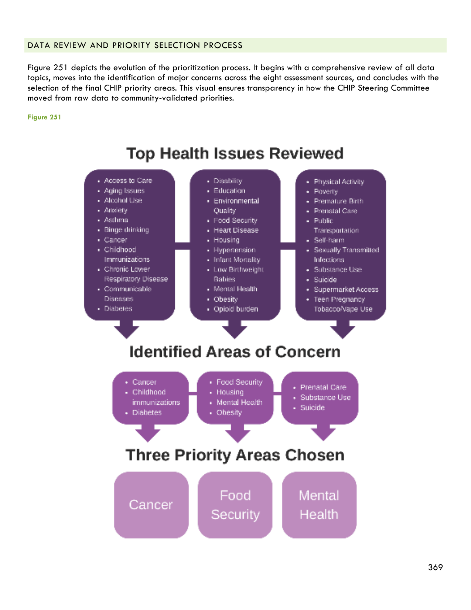

```{python}
#| echo: false
#| warning: false
#| message: false
import sys
from pathlib import Path

# Ensure root-level modules (scripts/) are importable in both Quarto run contexts.
cwd = Path.cwd()
project_root = cwd if (cwd / "scripts").exists() else cwd.parent
if str(project_root) not in sys.path:
    sys.path.insert(0, str(project_root))

CHA_WORKBOOK_PATH = project_root / "data" / "raw" / "workbook.xlsx"
```

Following the MAPP 2.0 framework, health priorities were identified through a rigorous process of data
triangulation. This method synthesized findings from three essential assessments:

**Community Status Assessment:** Analyzed quantitative health outcomes and social determinants of health to
identify existing inequities. This includes a review of demographics, mortality, leading health issues, and health
behaviors.

**Community Context Assessment:** Captured qualitative insights and lived experiences to understand the human
impact of social systems. This includes review of the forces of change assessment, community asset survey, focus
groups, key informant interviews, community health survey, and partner input.

**Community Partner Assessment:** Evaluated the collective capacity of the public health network to address
identified disparities. Continuous evaluation occurs during collaborative meetings and at the Public Health Summit.

By integrating these perspectives, the CHIP Steering Committee identified cross-cutting themes that moved beyond
individual behaviors to address the root causes of health inequity. This process directly informed the selection of
the final three priority areas, ensuring they are grounded in both empirical data and community-voiced needs.

### Data Review Guide

To support these assessments, a [Data Review Guide Summary](../pdfs/2025%20Annual%20Data%20Review%20Guide%20Summary.pdf) was developed that synthesizes over
150 data sources and health indicators. This resource combines the many datasets into an accessible format for
partners, offering a clear look at health trends over time. By streamlining this information, the guide allows partners
to monitor progress and make data-driven decisions more effectively.

<!-- ! Figure 163: Data Review Guide Summary -->
[Data Review Guide Summary](../pdfs/2025%20Annual%20Data%20Review%20Guide%20Summary.pdf)

### Data Summary Table

To identify common themes across various data collection methods, a crosswalk table [@tbl-top-areas-concern]
was developed to track the top three health priorities from each assessment and survey. This tool enables the
committee to synthesize the many data points and visually identify where community concerns, provider
perspectives, and secondary data intersect. By highlighting these overlapping priorities, the CHIP Steering
Committee can ensure the final health improvement plan addresses the most consistent and pressing needs of the
community.

<!-- Table 67: Top Areas of Concern Across All Assessments -->


### Data Review and Priority Selection Process

[@fig-data-review-process] depicts the evolution of the prioritization process. It begins with a comprehensive
review of all data topics, moves into the identification of major concerns across the eight assessment sources, and
concludes with the selection of the final CHIP priority areas. This visual ensures transparency in how the CHIP
Steering Committee moved from raw data to community-validated priorities.

{#fig-data-review-process fig-cap="Data Review and Priority Selection Process" fig-alt="Diagram showing evolution from comprehensive data review to major concerns across assessments to final CHIP priority areas." width="100%"}
